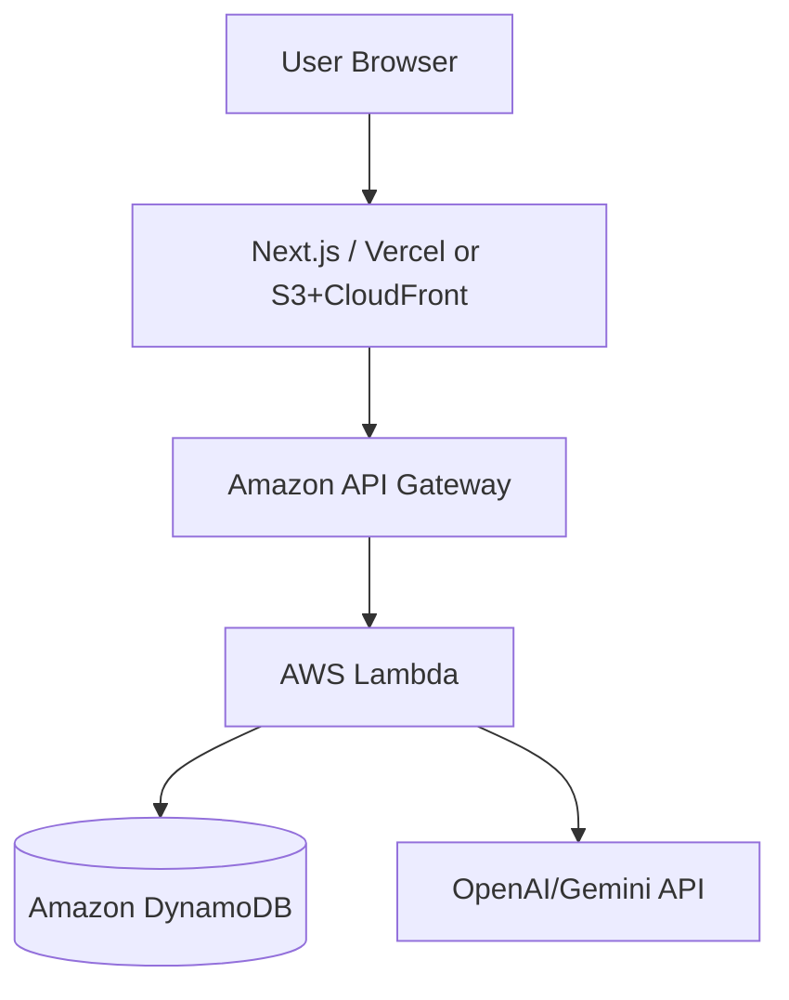

# システムアーキテクチャ設計

## 1. 構成概要
本システムは React (Next.js) をフロントエンドに、AWS Lambda と DynamoDB をバックエンドに使用したサーバーレスアーキテクチャで構成される。インフラ管理には OSLS（Serverless Framework互換のOSSフォーク、`serverless.yml`形式の設定を引き継ぐ）を使用する。

## 2. 技術スタック
- **Frontend**: Next.js (React), TypeScript, Tailwind CSS
- **Backend**: AWS Lambda, API Gateway
- **Database**: DynamoDB
- **Infrastructure**: OSLS（Serverless Framework互換のOSSフォーク）
- **AI Integration**: OpenAI API / Gemini API (将来)

## 3. コンポーネント構成

### 3.1 フロントエンド (Next.js)
- 捺印キャンバス：ドラッグ＆ドロップ、回転などの操作
- ステージ管理：現在の進捗保存、画面遷移
- 判定結果表示：差し戻し理由や合格通知の表示

### 3.2 バックエンド (AWS Lambda)
- `judgeHanko`: 捺印の位置・角度等を受け取り、ステージごとのルールに基づき合否を判定する
- `getStage`: 現在のステージ情報、必要とされるマナー（ルール）を取得する
- `updateProgress`: ユーザーの進捗を保存する

### 3.3 データベース (DynamoDB)
- `Users`: ユーザーID、現在のステージ、トータルスコア
- `Stages`: ステージID、タイトル、判定基準、差し戻しメッセージ集

## 4. インフラ構成図 (イメージ)

<details>
<summary>ソースを表示（mermaid記法）</summary>



上記の```mermaid```ブロックはPR差分ビュー・API経由でのファイル取得等ではテキストのまま表示され図として確認できない（[bamiyanapp/karuta#824](https://github.com/bamiyanapp/karuta/issues/824)）。ソース（mermaid記法）はこのまま維持しつつ、下記は`enable_mermaid_render`（`render-mermaid-diagrams` job）が`main`へのマージのたびに再レンダリングし、`docs-diagrams`ブランチの`latest/`へ上書き公開している画像（常に最新版）。

</details>


## 5. デプロイフロー
1. OSLS (`osls deploy`) により AWS リソース（Lambda, API Gateway, DynamoDB）を構築。
2. フロントエンドは別途ホスティング環境（Vercel推奨）へデプロイ。
